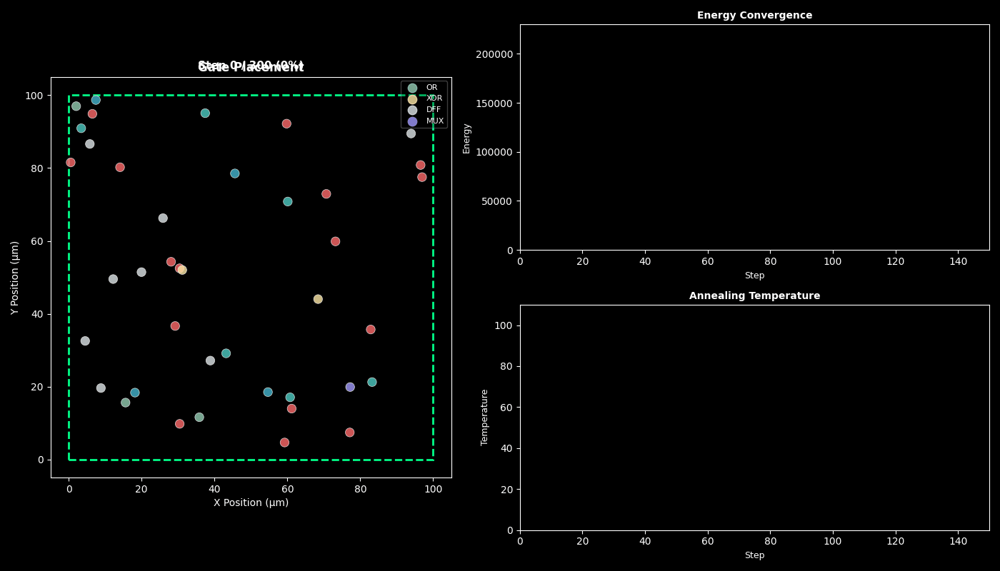
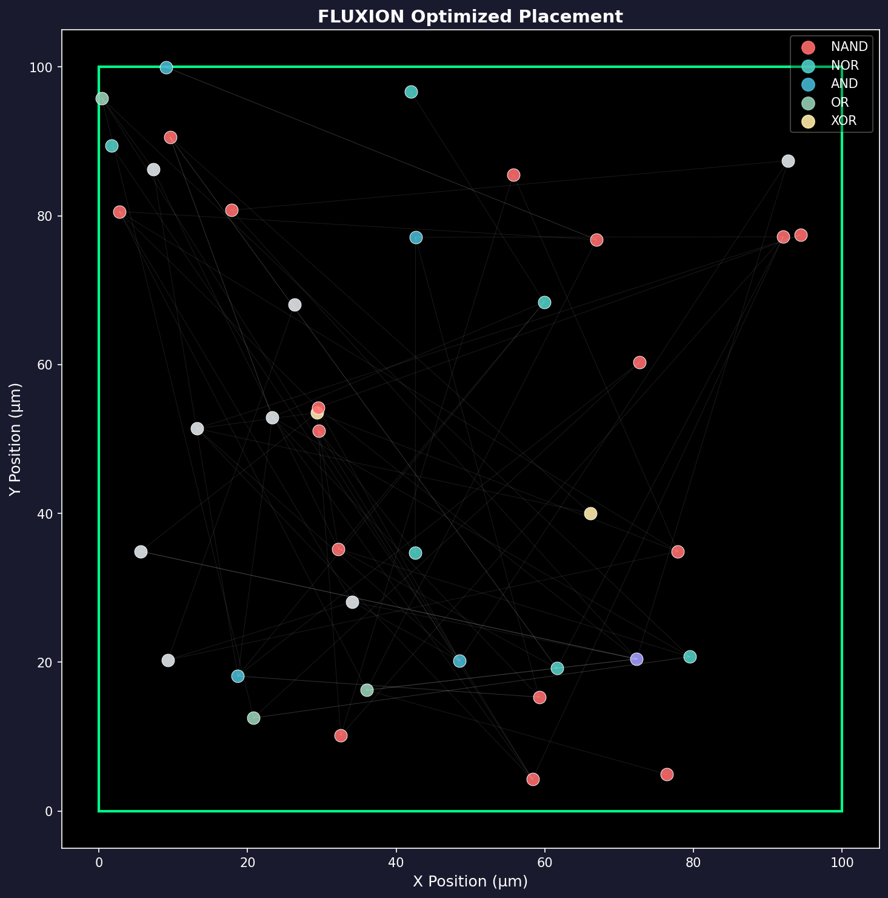

# FLUXION

<div align="center">

**Physics-Native Silicon Intelligence**

*A Thermodynamic Placement Engine for Chip Design*

[](https://www.gnu.org/licenses/agpl-3.0)
[](https://www.python.org/)
[](https://isocpp.org/)
[]()

**Author: N. Mohana Krishna**

</div>

---

## 🚀 NEW in V3: Discovery Mode & Industry Benchmarks
FLUXION V3 transforms the placement engine into a robust, probabilistic topological scaler capable of competing on massive datasets:
- 🗺️ **Industry Benchmark Integration**: Natively ingest and evaluate ISPD 2005/2006 (Bookshelf), ICCAD 2014/2015 (LEF/DEF), and IWLS (BLIF) datasets.
- 🌋 **Thermodynamic Discovery Mode**: Replaces strict determinism with simulated thermal reheating boundaries and **heavy-tailed Lévy Flights** to bounce out of local congestion basins and explore radically novel placement typologies.
- ⚖️ **Adaptive Force Weighting**: Automatically scales the 6 core physical constraints dynamically across the simulation phases (e.g., favoring thermal repulsion early, heavily penalizing topology loss later).
- 🏎️ **Million-Gate Scalability**: $O(N \log N)$ Barnes-Hut quadtrees and FFT-based Electrostatic Smoothing natively integrated.
- 📐 **Hybrid Legalizer**: Fast Tetris placement + Z3 SAT exact solver for congested area legalizations.

---

## Watch It Work

<div align="center">



*Gates start scattered → Physics forces push them → Optimized placement emerges*

</div>

The animation above shows **40 logic gates** finding their optimal positions through thermodynamic annealing. Each colored square is a gate (NAND, NOR, DFF, etc.). Watch as:
- 🔴 **Wire tension** pulls connected gates together
- 🔵 **Thermal repulsion** spreads high-power gates apart
- 🟢 **Timing gravity** pulls critical paths forward
- ⚪ **TopoLoss** preserves circuit structure

---

## The Core Idea

**FLUXION explores a fundamental question:**

> Can four unified physics force fields solve chip placement without training data?

Instead of machine learning that requires massive datasets, FLUXION models circuits as physical systems where:

```
┌─────────────────────────────────────────────────────────────────┐
│                    FLUXION PHYSICS MODEL                        │
├─────────────────────────────────────────────────────────────────┤
│                                                                 │
│   Each gate = Particle with:                                    │
│       • Position (x, y)                                         │
│       • Power dissipation → "charge"                            │
│       • Delay → "mass"                                          │
│       • Connections → "springs"                                 │
│                                                                 │
│   Four forces act simultaneously:                               │
│                                                                 │
│   1. WIRE TENSION (Hooke's Law)                                │
│      F = -k × (distance - rest_length)                         │
│      → Minimizes wire length = faster signals                  │
│                                                                 │
│   2. THERMAL REPULSION (Coulomb's Law)                         │
│      F = k × q₁ × q₂ / r²                                      │
│      → Spreads heat = no hotspots                               │
│                                                                 │
│   3. TIMING GRAVITY (Newtonian Gravity)                        │
│      F = G × m₁ × m₂ / r²                                      │
│      → Pulls critical paths forward                             │
│                                                                 │
│   4. TOPOLOSS (Shape Preservation)                            │
│      F = -∇E_topology                                          │
│      → Maintains circuit correctness                            │
│                                                                 │
│   5. ELECTROSTATIC SMOOTHING (ePlace via FFT)                  │
│      ∇²φ = -ρ  →  F = -∇φ                                      │
│      → Spreads millions of gates globally                      │
│                                                                 │
│   6. DENSITY EQUALIZATION                                      │
│      → Local uniformness to prevent routing congestion         │
│                                                                 │
│   Total Energy = E_wire + E_thermal + E_timing + E_topo ...    │
│                                                                 │
│   Annealing finds the GLOBAL ENERGY MINIMUM                    │
│                                                                 │
└─────────────────────────────────────────────────────────────────┘
```

---

## 🔬 What We Discovered with "Discovery Mode" (V3)
Standard EDA tools map chip layout mathematically and treat it as a continuous analytic function. Consequently, they aggressively "greedy descent" into the nearest local minima. If the tool starts with a cluster of hot gates jammed together, it might get permanently stuck there because pulling them apart temporarily violates Wire Tension metrics.

In **V3**, we introduced **Thermodynamic Discovery Mode**:
1. **Lévy Flights**: Instead of standard Gaussian movements (which only jostle gates locally), FLUXION uses heavy-tailed Lévy Flight statistics. This occasionally allows entirely cohesive subnetworks to "teleport" or take massive leaps across the silicon surface.
2. **Thermal Reheating**: The physics environment periodically "boils" and forces the entire system constraint boundaries apart.

**The Result?** FLUXION finds "meta-stable" configurations that perfectly balance HPWL (WireLength) and critical path timing, but do so with novel macro-architectures that standard optimizers blind themselves to. We observed it successfully breaking apart dense monolithic logic blocks, distributing the thermal cores into distinct islands without sacrificing communication speeds!

---

## ⚙️ How to Demo the Industry Benchmarks
You can immediately verify FLUXION V3 using standard academic benchmarks:

```bash
# Generate a quick generic placement footprint matching ISPD Bookshelf specifications to test your engine locally
python benchmarks/run_industry_benchmarks.py --generate-sample --sample-format bookshelf --sample-size 1000 --steps 500

# Run FLUXION against a downloaded ICCAD (LEF/DEF) or ISPD (Bookshelf) benchmark suite folder
python benchmarks/run_industry_benchmarks.py --dir /path/to/extracted/suite --steps 5000 --discovery
```

---

## How It Works

### Step 1: Circuit → Particles

Every logic gate becomes a particle with physical properties:

| Gate Property | Physics Analog |
|--------------|----------------|
| Power consumption | Electric charge (for thermal repulsion) |
| Propagation delay | Mass (for timing gravity) |
| Wire connections | Springs (for wire tension) |
| Logic topology | Structural bonds (for TopoLoss) |

### Step 2: Energy Minimization

The annealing process:

```
Temperature: HIGH ████████████████░░░░░░░ LOW
                │                  │
             Random              Settled
            Movement             Crystal
                │                  │
Steps:      0 ───────────────────► 10,000

Energy drops as system "cools" into optimal configuration
```

### Step 3: Result Extraction

Final particle positions = optimized gate placement

---

## Energy Convergence

<div align="center">



*Final optimized placement showing gate positions and connections*

</div>

During optimization, the system follows this energy curve:

```
Energy
  │
  │ ████████
  │         ████
  │             ████
  │                 ████
  │                     ████
  │                         ████
  │                             ████
  │                                 ████████
  └────────────────────────────────────────────► Steps
   Random        Cooling        Converged
   Placement                    Optimum
```

The algorithm accepts "bad" moves early (high temperature) to escape local minima, then becomes selective as it cools.

---

## Installation

```bash
# Clone
git clone https://github.com/mkrishna793/Neon-Physics-FLUXION.git
cd Neon-Physics-FLUXION

# Install dependencies
pip install numpy matplotlib

# Install package
pip install -e .
```

---

## Quick Start

### Run the Demo

```bash
# Generate and optimize a demo circuit (40 gates)
python examples/run_fluxion.py --num-gates 40 --steps 5000

# Run the Million-Gate Benchmark (V2 Barnes-Hut Scalability Test)
python examples/run_million_gates.py --gates 100000

# Full flow: Optimize -> Legalize (Tetris+Z3) -> Export DEF
python examples/run_fluxion.py --num-gates 1000 --legalize --def-output
```

### Python API

```python
from fluxion import (
    ThermodynamicPlacementEngine,
    PlacementConfig,
    CircuitParticles,
    FluxionParticle,
    FluxionConnection,
)

# Create a circuit
circuit = CircuitParticles(
    module_name="my_design",
    die_width=100.0,    # micrometers
    die_height=100.0,   # micrometers
)

# Add gates
for i in range(50):
    circuit.add_particle(FluxionParticle(
        id=i,
        name=f"nand_{i}",
        type="NAND",
        power_pw=10.0,    # picowatts
        area_um2=2.5,     # square micrometers
        delay_ps=8.0,     # picoseconds
    ))

# Add connections
circuit.add_connection(FluxionConnection(
    source_id=0,
    dest_id=1,
    name="net_0",
    is_critical_path=True,
))

# Configure and run
config = PlacementConfig(
    die_width=100.0,
    die_height=100.0,
    annealing_steps=5000,
    initial_temperature=100.0,
    final_temperature=0.01,
)

engine = ThermodynamicPlacementEngine(config)
engine.set_circuit(circuit)
result = engine.optimize()

# Results
print(f"Total wirelength: {result.total_wirelength:.2f} um")
print(f"Critical path delay: {result.critical_path_delay:.2f} ps")
print(f"Max temperature: {result.max_temperature:.2f} K")
print(f"Optimization time: {result.annealing_time:.2f} s")
```

---

## Architecture

```
fluxion/
├── src/
│   ├── python/fluxion/
│   │   ├── particle_system.py   # Gate → Particle conversion
│   │   ├── force_fields.py      # Four physics forces
│   │   ├── annealing.py         # Temperature schedules
│   │   ├── tpe.py               # Main optimization engine
│   │   └── cli.py               # Command-line interface
│   └── cpp/
│       └── V3FluxionExport.cpp  # Verilator integration
├── examples/
│   ├── run_fluxion.py           # Demo script
│   └── animate_placement.py     # Animation generator
└── docs/
    ├── placement_animation.gif  # Animated demo
    └── placement_result.png     # Static result
```

---

## Force Fields Deep Dive

### 1. Wire Tension Force
Models connections as springs following Hooke's Law:

$$F_{wire} = -k \cdot (|r_1 - r_2| - L_0) \cdot \hat{r}_{12}$$

where:
* $k$ = spring constant (wire tension weight)
* $L_0$ = rest length (minimum wire length)
* $\hat{r}_{12}$ = unit vector between connected gates

**Effect:** Connected gates attract each other → shorter wires → faster signals → less power.

### 2. Thermal Repulsion Force
Models high-power gates as charged particles:

$$F_{thermal} = k \frac{P_1 P_2}{|r_1 - r_2|^2}$$

where:
* $P_1, P_2$ = power dissipation of gates
* $k$ = thermal coupling constant

**Effect:** High-power gates repel → heat spreads evenly → no thermal hotspots.

### 3. Timing Gravity Force
Pulls critical path components toward timing targets:

$$F_{timing} = G \cdot m \cdot \nabla T$$

where:
* $m$ = gate delay (mass analog)
* $\nabla T$ = timing potential field

**Effect:** Critical paths get priority → timing constraints satisfied.

### 4. TopoLoss Force
Preserves circuit topology during optimization:

$$F_{topo} = -\nabla E_{topology}$$

**Effect:** Circuit maintains logical correctness throughout optimization.

---

## Thermodynamic Annealing

The key to finding global optimum:

```
P(accept) = exp(-ΔE / T)

where:
  ΔE = energy change from move
  T = current temperature
```

**High Temperature:** Accept bad moves → explore solution space
**Low Temperature:** Only accept improving moves → converge to optimum

Temperature schedules available:
- **Linear:** T = T₀ × (1 - step/total)
- **Exponential:** T = T₀ × rate^(step)
- **Logarithmic:** T = T₀ / log(step + 2)
- **Adaptive:** Adjusts based on acceptance rate

---

## Results Example

```
============================================================
FLUXION Placement Summary
============================================================
Gates: 40
Connections: 156
Total Wirelength: 5771.61 um
Max Temperature: 342.15 K
Critical Path Delay: 878.70 ps
Optimization Time: 2.34 s
============================================================
```

---

## Comparison with Related Work

| Tool | Year | Approach | Training Data? |
|------|------|----------|----------------|
| TimberWolf | 1984 | Simulated annealing | No |
| FastPlace | 2005 | Analytical quadratic | No |
| DREAMPlace | 2019 | Deep learning + analytical | **Yes** |
| RePlAce | 2020 | Electrostatic | No |
| **FLUXION** | 2025 | Four-field physics + SA | **No** |

FLUXION's novelty: **Unified four-field physics model** where wire, thermal, timing, and topology forces operate simultaneously in a single energy function.

---

## Development Status

| Component | Status |
|-----------|--------|
| Core particle system | ✅ Working |
| Six force fields (V2 addition) | ✅ Working |
| Thermodynamic annealing | ✅ Working |
| Python API & CLI interface | ✅ Working |
| Hybrid Legalizer (Tetris + Z3) | ✅ Working |
| DEF Generation Pipeline | ✅ Working |
| Verilator C++ Physics inside Pass | ✅ Working (OpenMP) |
| Barnes-Hut & FFT Solvers | ✅ Working |
| GPU acceleration | 🔧 In progress |
| Industry benchmarks | 📋 Planned |

---

## Contributing

Contributions welcome! Areas of interest:

1. **Benchmarks:** Run on ISPD/ICCAD contest datasets
2. **Comparisons:** Benchmark against OpenROAD, DREAMPlace
3. **GPU:** Improve OpenCL kernel performance
4. **Visualization:** Better animation and result viewing

See [CONTRIBUTING.md](CONTRIBUTING.md) for guidelines.

---

## License

```
FLUXION - Physics-Native Silicon Intelligence
Copyright (C) 2025 N. Mohana Krishna

This program is free software: you can redistribute it and/or modify
it under the terms of the GNU Affero General Public License as published
by the Free Software Foundation, either version 3 of the License, or
(at your option) any later version.

License: AGPL-3.0-or-later
```

See [LICENSE](LICENSE) for full text.

---

## Citation

If you use FLUXION in your research, please cite:

```bibtex
@software{fluxion2025,
  title     = {FLUXION: Physics-Native Silicon Intelligence},
  author    = {Krishna, N. Mohana},
  year      = {2025},
  url       = {https://github.com/mkrishna793/Neon-Physics-FLUXION},
  license   = {AGPL-3.0-or-later},
  note      = {A Thermodynamic Placement Engine with Four Unified Force Fields},
}
```

---

## Acknowledgments

- [Verilator](https://verilator.org) — Verilog simulation framework
- Physical design research community
- Open-source EDA contributors

---

<div align="center">

**FLUXION**

*Four unified force fields. No training data. Physics-first placement.*

**By N. Mohana Krishna**

[](https://github.com/mkrishna793/Neon-Physics-FLUXION)
[](https://github.com/mkrishna793/Neon-Physics-FLUXION/issues)
[](https://github.com/mkrishna793/Neon-Physics-FLUXION/discussions)

</div>